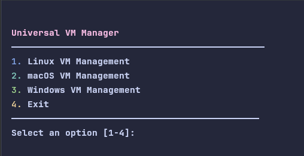
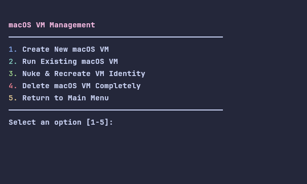
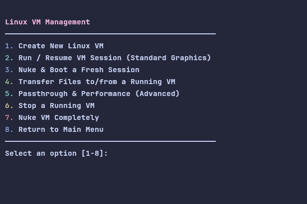

<p align="center">
  
  <h1 align="center">Glint</h1>
  <p align="center">
    <strong>The Universal VM Manager That Just Works.</strong>
    <br />
    Create, manage, and secure macOS, Windows, and Linux VMs with zero fuss.
  </p>
  <p align="center">
    
    
    
    
  </p>
</p>

Have you ever spent hours trying to get a macOS VM to boot, only to be met with a black screen and a wall of cryptic errors? Have you ever wished you could just *have* a clean, working Linux or macOS environment without the headache of manual setup, configuration files, and endless forum searches?

**Glint is the answer.**

This isn't just another VM manager. Glint is a smart, user-friendly tool built to do one thing perfectly: get you a powerful, fully functional virtual machine with the least amount of effort. It's for anyone who has ever thought, "This should be easier."

---

## ✨ Why Glint? Because You Have Better Things to Do.

Glint was built to solve the most frustrating parts of virtualization.

*   **For the macOS Enthusiast:**
    **Finally, a macOS VM that just works.** Glint is the star of the show here. It automates the entire OpenCore configuration, SMBIOS generation, and hardware ID synchronization. This means you get a VM that not only boots, but also has the best possible chance of working with Apple services like iMessage and iCloud, all without you ever having to touch a `.plist` file.

*   **For the Everyday User:**
    **Get a full desktop in minutes.** Whether you want to try out a new Linux distro or need a secure macOS environment, Glint guides you through a simple, menu-driven process. It even detects and helps you install any missing dependencies. No command-line wizardry required.

*   **For the Developer & Security Pro:**
    **Power and privacy, simplified.** Underneath the simple interface is a powerful engine. Glint's unique "disposable" architecture lets you instantly reset your VM to a pristine, forensically clean state with a new identity (new serials, new MAC address), perfect for testing, malware analysis, or ensuring absolute privacy.

---

## ✨ Core Features

Glint is packed with features designed to make VM management powerful, flexible, and simple.

*   **Zero-Config macOS:** Forget the nightmare of manually configuring OpenCore. Glint handles everything, building a perfectly patched bootloader for your VM every single time.
*   **macOS GPU Passthrough:** A guided menu to pass through a physical GPU (iGPU or dGPU) to your macOS VM for near-native graphics performance.
*   **Automated File Transfer:** An integrated SFTP utility to easily transfer large files to and from any running VM, with automatic port forwarding.
*   **iMessage & Apple Services Ready:** Glint automatically generates and injects the necessary serial numbers and hardware IDs, giving you the best chance at compatibility with Apple services out of the box.
*   **Disposable & Persistent Architecture:** The core of Glint. Keep your OS installation pristine while having the ability to instantly "nuke" a session, creating a forensically clean machine with a new identity (new serial numbers, UUIDs, MAC addresses) without reinstalling.
*   **Advanced GPU Passthrough (Linux VMs):**
    *   **Live Passthrough:** Dedicate a GPU, USB controller, or NVMe drive to your Linux VM for near-native performance.
    *   **Automated Host Preparation:** The script handles stopping your display manager, binding drivers to `vfio-pci`, and safely restoring your host session when the VM shuts down.
    *   **System Compatibility Checker:** A built-in tool to check your IOMMU groups, kernel settings, and hardware configuration for passthrough readiness.
*   **PCI Passthrough for macOS:** Connect your iPhone to Xcode inside the VM. By passing through a USB controller directly to macOS, you can achieve a native development experience, including live device debugging.
*   **User-Friendly TUI:** A simple, terminal-based interface that guides you through every step, from creation to execution.
*   **Automatic Dependency Resolution:** The script automatically detects your Linux distribution and offers to install any missing dependencies, such as QEMU, OVMF, and other required tools.
*   **Integrated File Transfer:** Easily copy files and folders to and from a running Linux VM using SCP, with port forwarding handled automatically.
*   **Installer Downloader:** Includes a script to fetch macOS recovery images directly from Apple's servers if you don't have one.

---

## 🖼️ A Glimpse of Glint

Glint's interface is designed to be simple, clean, and intuitive.

**Main Menu:** Your central hub for managing both Linux and macOS virtual machines.


**macOS VM Menu:** All the tools you need for your macOS VMs, from creation to identity management.


**Linux VM Menu:** A comprehensive set of options for your Linux VMs, including advanced passthrough features.


---

## 🚀 How It Works: The Disposable & Persistent Model

Glint introduces a new way to think about virtualization. Every VM you create has two parts: a **stable base installation** and a **disposable session identity**.

### ✅ Safe & Non-Destructive by Design

Before we dive in, it's critical to understand one thing: **the "Nuke" commands will NEVER delete your base operating system installation.** The `macOS.qcow2` or `base.qcow2` files that hold your OS are never touched. "Nuking" simply deletes the session and identity files, allowing you to start a fresh session on your existing installation, saving you from ever having to reinstall the OS.

### The "Nuke" Button: Your Digital Reset Switch

This is the core of Glint's power. The "Nuke" option is your one-click solution for creating a forensically new machine on top of your stable OS installation.

| Operating System | What Gets DELETED (The Disposable Part) | What is ALWAYS KEPT (The Persistent Part) |
| :--------------- | :-------------------------------------- | :-------------------------------------- |
| **macOS**        | `OpenCore.qcow2` (The Bootloader & Identity) | `macOS.qcow2` (Your OS Installation)    |
| **Linux**        | `overlay.qcow2` (The Session & All Changes) | `base.qcow2` (Your OS Installation)     |

#### For macOS: A New Mac, Every Time

When you "Nuke & Recreate" a macOS VM, you are creating what is, for all intents and purposes, a **brand-new computer** that boots from your existing installation. Glint automatically:
*   **Generates a New SMBIOS:** A completely new, valid Serial Number, Board Serial, and UUID are created.
*   **Generates a New MAC Address:** The virtual network card gets a new, unique hardware address.
*   **Synchronizes Hardware ID:** The new MAC address is surgically injected into the configuration as the `ROM` value, creating a perfect 1-to-1 match that is critical for Apple service compatibility.
*   **Rebuilds the Bootloader:** The `OpenCore.qcow2` disk is completely destroyed and rebuilt from a known-good, community-vetted configuration.

**The Result:** In seconds, you have a VM that appears to Apple's servers and any forensic tool as a completely different machine, all while booting your same, stable macOS installation.

#### For Linux: A Clean Slate

When you "Nuke & Boot" a Linux VM, Glint provides a pristine, untouched environment by deleting the session overlay.
*   **Destroys the Overlay:** The entire session overlay, including all changes, logs, and user data, is permanently deleted.
*   **Generates a New Machine ID:** A new UUID and MAC address are generated for the new session.
*   **Resets the UEFI Environment:** A fresh copy of the UEFI variables is created from the system template.

**The Result:** You are booting from your clean base image into a completely new session, with no history and no fingerprints from previous work, without ever having to reinstall.

### Persistence is a Choice

This incredible disposability doesn't mean your work is volatile. By simply choosing **"Run Existing VM"**, you can maintain a persistent state for as long as you need, preserving your files, applications, and settings across reboots. Glint gives you the power to choose when you want to be persistent and when you want to be a ghost.

---

## 🛠️ Getting Started

### 1. Prerequisites

*   **Operating System:** A modern Linux distribution (Arch, Debian, Ubuntu, Fedora, etc.).
*   **Required Software:** `git` and `python3`.

### 2. Clone the Repository

```bash
git clone https://github.com/Trex099/Glint.git
cd Glint
```

### 3. Place Installers

For the "Create VM" options to work, you **must** place your OS installer files in the `Glint` directory:
*   **macOS:** A full installer `.iso` or a `BaseSystem.dmg`/`.img` file.
*   **Windows:** An `.iso` file. A `virtio-win-*.iso` file is also highly recommended.
*   **Linux:** A standard `.iso` file.

### 4. Run Glint

That's it. The script handles the rest.

```bash
python3 glint.py
```

When you run Glint for the first time, it will:
1.  Detect your Linux distribution.
2.  Check for required dependencies (like QEMU, OVMF, and `mtools`).
3.  If anything is missing, it will provide you with the exact command to install it and offer to run it for you.

*Note: The script will use `sudo` internally for operations that require root privileges, such as installing packages or managing system services for GPU passthrough.*

---

## ⚡ Advanced Features

### 🖥️ macOS GPU Passthrough

This feature allows you to give a macOS VM direct control over one of your host's physical GPUs.

> **⚠️ WARNING: Advanced Users Only**
> This is an advanced feature that requires your host system to be properly configured for **IOMMU (VT-d / AMD-Vi)** in your BIOS/UEFI and with the correct kernel parameters. Glint only handles the VM configuration; it does not set up your host. Incorrectly passing through a device can lead to host system instability.

**How to use it:**
1.  Navigate to the `macOS VM Management` menu.
2.  Select `Passthrough & Performance`.
3.  The script will guide you through selecting a VM and a GPU. It will automatically patch the VM's configuration for you.

### 📂 File Transfer (SFTP)

Glint includes a simple menu to transfer large files or directories to and from any running VM.

**How to use it:**
1.  **Enable SSH in the Guest VM (One-time setup):**
    *   **macOS:** Open the Terminal app inside your macOS VM and run:
        ```sh
        sudo systemsetup -setremotelogin on
        ```
    *   **Linux:** Install the OpenSSH server (e.g., `sudo apt install openssh-server` or `sudo pacman -S openssh`) and ensure the `sshd` service is running.
    *   **Windows:** Enable the OpenSSH Server optional feature.
2.  From the appropriate VM menu in Glint, select `Transfer Files (SFTP)`.
3.  Follow the prompts to enter your VM's username, password, and the file paths.

---

## ❤️ Credits and Acknowledgements

This project stands on the shoulders of giants. Glint wouldn't be possible without the incredible work of the open-source community.

*   **QEMU:** For providing the powerful, flexible, and open-source virtualization engine that makes all of this possible.
*   **OpenCore:** For their sophisticated bootloader that allows us to boot macOS on non-Apple hardware.
*   **OSX-KVM:** For providing invaluable references and a solid foundation for macOS virtualization on Linux.
*   **GenSMBIOS:** For the essential tool that makes generating valid SMBIOS information a breeze.

---

## ⚖️ Legality of macOS on Non-Apple Hardware

While this project provides the technical means to install macOS in a virtual machine on non-Apple hardware, it is important to understand the legal and ethical implications. Apple's End User License Agreement (EULA) for macOS states that the operating system is only to be installed on Apple-branded hardware.

From the macOS Sonoma EULA:
> "...you are granted a limited, non-transferable, non-exclusive license... to install, use and run one (1) copy of the Apple Software on a single Apple-branded computer at any one time."

By using this tool to install macOS on a non-Apple system, you are acting in violation of this EULA. This project is provided for educational and research purposes only. The developers of Glint are not responsible for your use of this software, and you assume all responsibility for complying with Apple's licensing terms.

We do not provide support for and are not responsible for any legal issues that may arise from your use of this project. We encourage all users to respect the licensing of the software they use.

---

## 🔮 Upcoming Features

Glint is an actively developed project. Here's what we have planned for the future:

*   **Snapshot Management:** The ability to take and restore snapshots of your persistent VM states.
*   **GUI Frontend:** A simple graphical user interface for users who prefer a visual workflow.

---

## ❤️ Contributing

We welcome contributions from the community! If you have an idea for a new feature, a bug fix, or an improvement to the documentation, please feel free to open an issue or submit a pull request.

---

## 📜 License

This project is licensed under the MIT License. See the `LICENSE` file for details.
