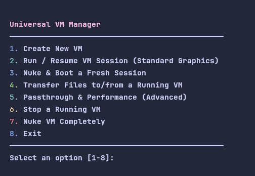

Universal QEMU/KVM VM Manager

A powerful, user-friendly, terminal-based manager for QEMU/KVM virtual machines. This script simplifies the entire VM lifecycle, from creation and daily use to advanced hardware passthrough, with a strong focus on safety, user guidance, and automation.

Overview

This script was born out of the need to streamline complex VM operations on Linux. While tools like virt-manager are excellent, they can be heavy and don't easily script the setup for advanced features like "live" GPU passthrough. This tool aims to provide that power in a simple, interactive TUI, handling the tedious and error-prone parts of VM management for you.
Features
Core VM Management

    ✅ Automated VM Creation: Creates a new VM from an ISO with just a few prompts.

    ✅ Snapshot-Style Sessions: Uses a qcow2 overlay system. Your base installation remains pristine, while all changes are saved to a separate session disk.

    ✅ Nuke & Boot: Instantly revert a VM to its clean, post-installation state. Perfect for testing or starting fresh without reinstalling.

    ✅ File Transfer: A simple scp wrapper to easily move files and folders to or from a running VM.

    ✅ System-Wide Dependency Checks: Automatically detects your Linux distribution and checks if all necessary packages (qemu, ovmf) are installed.

    ✅ Standard Operations: Simple menu options to stop, start, and completely delete VMs.

Advanced Passthrough & Performance

    ✅ Live Hardware Passthrough: Assign a GPU, USB Controller, or NVMe drive to your VM for near-native performance. The binding is done "live," meaning no permanent system changes or reboots are required between uses.

    ✅ Intelligent Strategy Engine: Automatically diagnoses your hardware configuration (Laptop vs. Desktop, MUX switch mode, active GPU) and recommends the safest, most effective passthrough strategy.

    ✅ Automated Host State Management: For scenarios requiring it, the script can automatically stop your host's graphical desktop session and reliably restart it after the VM shuts down.

    ✅ "Headless Host" Safety: The script provides clear, context-aware warnings when your screen is expected to go black and explicitly instructs you on how to view the VM's output (e.g., via an external monitor).

    ✅ Comprehensive Sanity Checks: Before any passthrough attempt, the script verifies IOMMU is enabled, groups are safe, and the necessary vfio-pci kernel module is loaded and configured.

    ✅ Safe "Undo" Feature: Automatically creates backups of any system files it modifies, allowing you to safely revert all changes with a single menu option.

Prerequisites

    Sudo Access: The script must be run with sudo as it requires low-level access to manage devices and kernel modules.

    Virtualization Enabled: You must have CPU virtualization (Intel VT-x or AMD AMD-V) enabled in your computer's BIOS/UEFI.

    KVM Kernel Modules: Your Linux kernel must have the KVM modules loaded. This is standard on most modern distributions.

    Required Packages: The script's dependency check will guide you, but you need qemu and edk2-ovmf (or ovmf). The script will offer to install these for you on supported distributions (Arch, Debian, Ubuntu, Fedora, etc.).

Installation & Usage

    Save the script as vm_manager.py.

    Make it executable: chmod +x vm_manager.py

    Run it with sudo: sudo python3 vm_manager.py

You will be greeted by the main menu.
Main Menu Options Explained

    1. Create New VM: The first step. This will guide you through creating a base disk image and installing an operating system from an .iso file.

    2. Run / Resume VM Session (Standard Graphics): This launches a VM in its last saved state using a standard QEMU graphical window. Use this for general tasks.

    3. Nuke & Boot a Fresh Session: This deletes the VM's current session (the overlay disk) and starts it from its clean base image.

    4. Transfer Files to/from a Running VM: A simple wizard to use scp for file transfers. The VM must be running and have an SSH server installed.

    5. Passthrough & Performance (Advanced): The entry point for all high-performance features. See the detailed section below.

    6. Stop a Running VM: Sends a shutdown signal to a running VM.

    7. Nuke VM Completely: DESTRUCTIVE. This will permanently delete an entire VM, including its base disk and all associated files.

    8. Exit: Closes the script.

Deep Dive: Passthrough & Performance (Advanced)

This is the script's most powerful feature set.
[2] Run System Compatibility Checklist

Before attempting a passthrough, always run this checklist. It performs a series of non-destructive checks to see if your system is ready. It will verify:

    IOMMU Support: Confirms your CPU and motherboard are configured for passthrough.

    GPU Detection: Finds all available GPUs and their drivers.

    VFIO Module: Checks if the necessary vfio-pci kernel module is loaded. If not, it will offer to create the configuration file for you, which requires a one-time reboot.

    IOMMU Group Sanity: Ensures that the GPU you want to pass through is in a "clean" group that won't take essential system devices (like your storage controller) with it, preventing a host crash.

[1] Run VM with 'Live' Passthrough

This is the main event. The script's intelligent diagnostic engine makes this process safe and informative.

    Diagnosis: First, the script determines your system's configuration.

    Device Selection: You will be prompted to select which device(s) you want to pass to the VM.

    Pre-Flight Checklist: Before taking any action, the script will present you with a summary of the plan and a critical warning explaining exactly what is about to happen based on your hardware.

        CRITICAL FOR LAPTOP USERS: If you are passing through your powerful NVIDIA/AMD GPU, the script will warn you that your built-in screen WILL GO BLACK. This is normal. To see your VM, you MUST connect an external monitor to your laptop's HDMI or DisplayPort.

    Execution: After your final confirmation, the script hands off control to a detached background process that:

        Stops your host's graphical desktop (if necessary).

        Rebinds the selected PCI devices to the vfio-pci driver.

        Launches the QEMU VM.

        Waits for the VM to shut down.

        Automatically runs a cleanup sequence to return all devices to the host and restart your graphical desktop, returning you to your login screen.

[4] What to Expect & How to Use Passthrough

This option provides a built-in guide explaining the core concepts, including why the screen goes black and how to view the VM's display.
[5] Revert ALL Passthrough-Related System Changes

This is your safety net. This option will find any configuration files the script has modified or created and restore them from the safe .vm_manager.bak backups. It will then provide you with the final commands (update-grub, etc.) to fully return your system to its pre-script state.
A Note on Laptops & MUX Switches

For users with modern gaming laptops (like the Acer Predator Helios series), you may have a MUX switch that controls the display wiring. You can control this in your BIOS/UEFI or a vendor application (like PredatorSense) in Windows.

    Hybrid / Optimus Mode (Default): The Intel iGPU is connected to the screen. To passthrough the dGPU (NVIDIA/AMD), the host desktop must be stopped, and you must use an external monitor.

    dGPU-Only / Ultimate Mode: The dGPU (NVIDIA/AMD) is connected to the screen. This is the recommended mode for this script. In this mode, your host runs on the powerful dGPU, and you can safely pass the now-idle Intel iGPU to a VM, which will run in a simple window on your desktop with no black screen.
